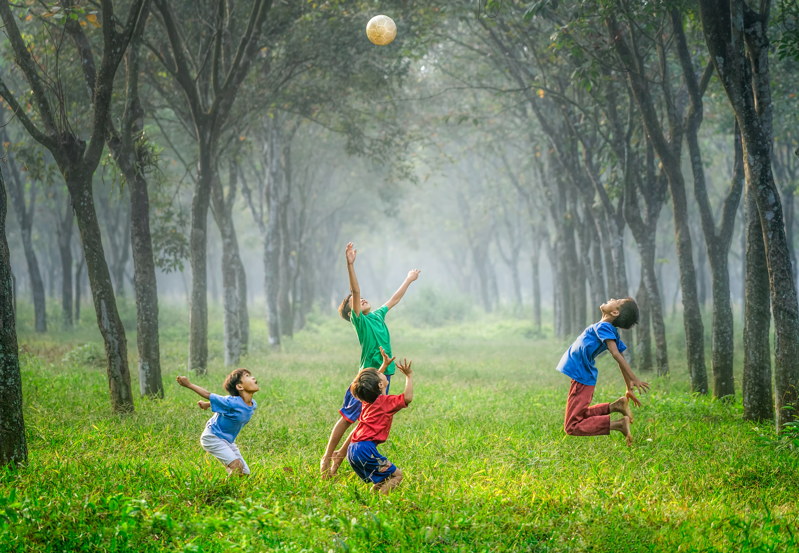

# Kata El Juego de la Vida. 
## Iteración 03 Desarrollo Basado en Pruebas

<span>Photo by <a href="https://unsplash.com/@robbie36?utm_source=unsplash&amp;utm_medium=referral&amp;utm_content=creditCopyText">Robert Collins</a> on <a href="https://unsplash.com/s/photos/life?utm_source=unsplash&amp;utm_medium=referral&amp;utm_content=creditCopyText">Unsplash</a></span>

## Pre-requisitos
- [ ] [Instalar y utilizar Rubocop](https://github.com/bright-coders/commons/tree/master/topics/rubocop)
- [ ] Instalar y utilizar [Rspec](https://rspec.info/) ó [Minitest](https://github.com/seattlerb/minitest) para pruebas unitarias

## Nuevo requerimiento
De nuevo trabajarás en la implementación del juego de la vida. Para que el ejercicio funcione, debes iniciar desde cero, es decir, no debes tomar código de la sesión pasada. 
En esta ocasión en tu implementación  además de ser completamente orientada a objetos, deberá incorporar pruebas unitarias. El objetivo sigue siendo lograr el mayor avance posible.
Los siguientes enlaces sirven para documentarte en la forma en la que el desarrollo basado en pruebas se realiza con Ruby:
- [Introducción al TDD por Eduardo Hernández ingeniero de MagmaLabs](https://github.com/bright-coders/commons/tree/master/topics/tdd)
- [UPCASE Learn Testing](https://thoughtbot.com/upcase/testing)
- [UPCASE Fundamentals of TDD](https://thoughtbot.com/upcase/fundamentals-of-tdd)
- [UPCASE Test Driven With Rails](https://thoughtbot.com/upcase/test-driven-rails)
- [UPCASE Rails Testing Exercises](https://thoughtbot.com/upcase/rails-testing-exercises)
- [UPCASE Test doubles](https://thoughtbot.com/upcase/test-doubles)

## Requerimientos Funcionales
Addapted from [Coding Dojo](https://codingdojo.org)

The Game of Life is not your typical computer game. It is a 'cellular automaton', and was invented by Cambridge mathematician John Conway.

This game became widely known when it was mentioned in an article published by Scientific American in 1970. It consists of a collection of cells which, based on a few mathematical rules, can live, die or multiply. Depending on the initial conditions, the cells form various patterns throughout the course of the game.

This Kata is about calculating the next generation of Conway’s game of life, given any starting position. 

You start with a two dimensional grid of cells, where each cell is either alive or dead. In this version of the problem, the grid is finite, and no life can exist off the edges. When calcuating the next generation of the grid, follow these rules:

1. Any live cell with fewer than two live neighbours dies, as if caused by underpopulation.
2. Any live cell with more than three live neighbours dies, as if by overcrowding.
3. Any live cell with two or three live neighbours lives on to the next generation.
4. Any dead cell with exactly three live neighbours becomes a live cell.

You should write a program that can accept an arbitrary grid of cells, and will output a similar grid showing the next generation.

### Clues
The input starting position could be a text file that looks like this:
```
Generation 1:
4 8
........
....*...
...**...
........
```
And the output could look like this:
```
Generation 2:
4 8
........
...**...
...**...
........
```
## Requerimientos no funcionales
- Calidad
  - Utilizar estilo de código definido por la comunidad (apoyarse en Rubocop)
  - Pruebas unitarias
- Desempeño y escalabilidad
  - Puede ejecutarse desde la linea de comandos y mostrar la salida en consola
- Código fuente
  - Orientado a Objetos 
  - Métodos Pequeños
  - [Aplicar los principios SOLID](https://rubygarage.org/blog/solid-principles-of-ood)
  
## Tecnologías
- Lenguaje de programación Ruby
- Framework para pruebas [Rspec](https://rspec.info/) ó [Minitest](https://github.com/seattlerb/minitest)
- Línea de comando

## Entregable
- Código fuente en Github (en la rama master)
- Los commits de Git deben ser significativos

## Resources
[Encuentra aquí una lista completa de recursos de ayuda](https://github.com/bright-coders/commons/tree/master/topics/resources)
